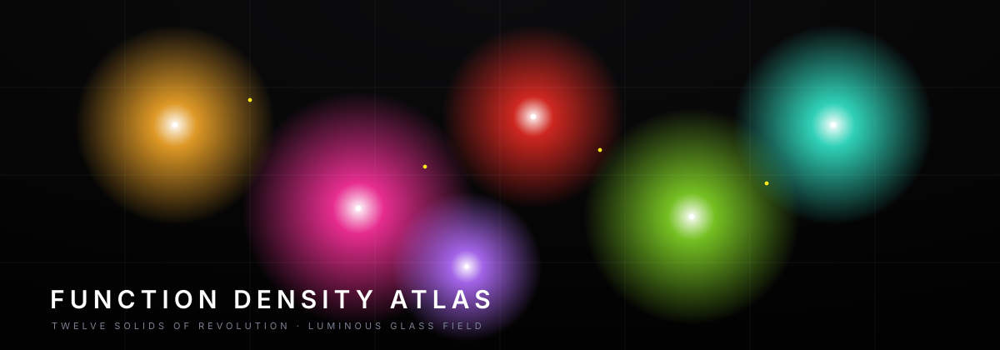

# Function Density Atlas



Doce funciones matemáticas, cada una convertida en un **sólido de revolución**
de vidrio iridiscente que respira sobre negro. Un campo de puntos luminosos
dibuja la superficie, un enjambre de partículas la recorre en espiral dejando
estela, y un barrido de luz la escanea — datos como luz aditiva, al estilo de un
mapa de densidad nocturno.

> Pasa el cursor sobre una celda y el sólido **morphea de revolución a
> extrusión**, se intensifica y el resto del grid se atenúa. Haz **clic** para
> fijar el foco; navega con las **flechas**.

## Las doce funciones

Cada campo tiene un color de categoría (núcleo blanco-caliente que se funde al
hue en el borde):

| # | Campo | Función | Hue |
|---|-------|---------|-----|
| F01 | SINE | `y = sin x` |  |
| F02 | COSINE | `y = cos x` |  |
| F03 | QUADRATIC | `y = x²` |  |
| F04 | ROOT | `y = √x` |  |
| F05 | INVERSE | `y = 1/x` |  |
| F06 | EXPONENTIAL | `y = eˣ` |  |
| F07 | SINC | `y = sin x / x` |  |
| F08 | GAUSSIAN | `y = e^(−x²)` |  |
| F09 | ABSOLUTE | `y = \|x\|` |  |
| F10 | TANGENT | `y = tan x` |  |
| F11 | LOG | `y = ln x` |  |
| F12 | DAMPED | `y = e^(−x/4) cos 3x` |  |

## Qué hay en cada celda

- **Sólido de revolución** en vidrio iridiscente que morphea a extrusión en hover.
- **Campo de puntos** aditivos con rampa térmica (núcleo blanco → hue al borde).
- **Heat bloom** difuso detrás, como un halo de densidad.
- **Quantity dots** amarillos dispersos — una segunda codificación.
- **Enjambre de partículas** en espiral, cada una con estela; un **barrido** de luz
  recorre el eje.
- **Bloom**, tone-mapping ACES, viñeta, niebla de profundidad y un sutil
  parallax de cámara.
- Chrome de instrumento: título, índice, leyenda de densidad, flecha norte y
  barra de escala — todo sobre una rejilla de papel milimetrado.

## Stack

`Vite` · `TypeScript` · `React` · `react-three-fiber` · `drei` ·
`@react-three/postprocessing` · `three` · `KaTeX`.

## Desarrollo

```bash
npm install
npm run dev        # http://localhost:5173
npm run build      # tsc --noEmit + vite build
```

## QA

```bash
node scripts/check.mjs        # contextos WebGL vivos + 0 errores de consola
SHOT=1 node scripts/check.mjs # además intenta un screenshot (GPU real)
```

El check abre la página en un navegador headless y verifica que las 12 celdas
cargan, que cada contexto WebGL es válido y no se pierde, y que no hay errores de
consola. (La revisión visual se hace mejor en una GPU real: capturar muchos
canvas WebGL a la vez se atasca en render por software.)

## Accesibilidad

Celdas operables por teclado (foco visible, flechas, Enter/Escape) y respeto a
`prefers-reduced-motion` (congela rotación, parallax y partículas).
